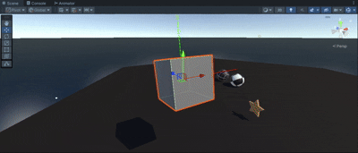
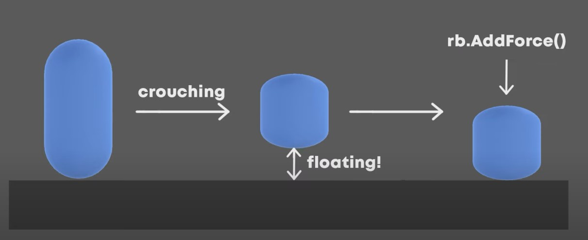
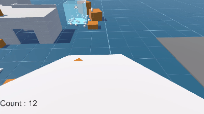

# UnityOfficialTutorial(Updating...)

做游戏是我的梦想，即使困难重重。

Life endures, games persist.

**💬学习知识汇总**

<b>第一章：主/副摄像机切换 | 车轮碰撞体 | 简单控制 | 视角跟随 💨 [PlayerContoller.cs](Prototype%201/Assets/Scripts/PlayerController.cs)</b>

<br />

<b>第二章：[单例设计模式](#p2k1) | [对象池原理](#p2k2) | 简单UI | 随机生成 💨 [相关代码](Prototype%202/Assets/Scripts)</b>

<br />

<b>第三章：[GetComponent原生存储+双路径优化](#p3k1) | 简单粒子 | 简单音效 | 简单动画 💨 [PlayerContoller.cs](Prototype%203/Assets/Scripts/PlayerController.cs)</b>

<br />

<b>第四章：[协程用法与原理](#p4k1) | [欧拉角(万向死锁)](#p4k2) | 视角旋转 | 敌人追踪 | 多轮进攻 | 强化物品闪烁 💨 [GameManager.cs](Prototype%204/Assets/Scripts/SpawnManager.cs)</b>

<br />

<b>第五章：[UGUI渲染逻辑(DrawCall)](#p5k1) | 重启游戏 | 分数显示 | 计时器 💨 [GameManager.cs](Prototype%205/Assets/Challenge%205/Scripts/GameManagerX.cs)</b>

<br />

<b>第一人称控制器：[视角控制](FIRST%20PERSON%20MOVEMENT/Assets/Scripts/Camera/CameraController.cs) | [基本输入控制(移动，跳跃，蹲伏)](FIRST%20PERSON%20MOVEMENT/Assets/Scripts/PlayerMovement.cs) | [滑行](FIRST%20PERSON%20MOVEMENT/Assets/Scripts/Sliding.cs) | [贴墙跑](FIRST%20PERSON%20MOVEMENT/Assets/Scripts/WallRunning.cs) | [物品交互](FIRST%20PERSON%20MOVEMENT/Assets/Scripts/ObjectsInteractive.cs)</b>

<br />

<b>UI：[DrawCall简单优化](#ui1) | [响应式UI](#ui2) | [LeanTween插件](#ui3)</b>

<hr />

**💬Learning Knowledge Summary**

<b>Chapter 1: Main/Secondary Camera Switching | Wheel Collider | Simple Control | Camera Following 💨 [PlayerContoller.cs](Prototype%201/Assets/Scripts/PlayerController.cs)</b>

<br />

<b>Chapter 2: [Singleton Design Pattern](#p2k1) | [Object Pool Principle](#p2k2) | Simple UI | Random Spawning 💨 [Relevant Codes](Prototype%202/Assets/Scripts)</b>

<br />

<b>Chapter 3: [GetComponent Native Storage + Dual-Path Optimization](#p3k1) | Simple Particles | Simple Sound Effects | Simple Animations 💨 [PlayerContoller.cs](Prototype%203/Assets/Scripts/PlayerController.cs)</b>

<br />

<b>Chapter 4: [Coroutine Usage and Principle](#p4k1) | [Euler Angles (Gimbal Lock)](#p4k2) | Camera Rotation | Enemy Tracking | Multi-Round Attack | Power-Up Item Blinking 💨 [GameManager.cs](Prototype%204/Assets/Scripts/SpawnManager.cs)</b>

<br />

<b>Chapter 5: [UGUI Rendering Logic (DrawCall)](#p5k1) | Game Restart | Score Display | Timer 💨 [GameManager.cs](Prototype%205/Assets/Challenge%205/Scripts/GameManagerX.cs)</b>

<br />

<b>First-Person Controller: [Camera Control](FIRST%20PERSON%20MOVEMENT/Assets/Scripts/Camera/CameraController.cs) | [Basic Input Control (Movement, Jumping, Crouching)](FIRST%20PERSON%20MOVEMENT/Assets/Scripts/PlayerMovement.cs) | [Sliding](FIRST%20PERSON%20MOVEMENT/Assets/Scripts/Sliding.cs) | [Wall Running](FIRST%20PERSON%20MOVEMENT/Assets/Scripts/WallRunning.cs) | [Object Interaction](FIRST%20PERSON%20MOVEMENT/Assets/Scripts/ObjectsInteractive.cs)</b>

<br />

<b>UI：[Simple Optimization of DrawCall](#ui1) | [Responsive UI](#ui2) | [LeanTween Plugin](#ui3)</b>

## Unity Junior Programmer (Completed !)

### Prototype 1

**▌ Features:**

- Allow the player to press a key on the keyboard to switch camera views.
- Transform this into a "local multiplayer" spilt-screen game with two cars where one car is controlled by WASD and the other is controlled by the arrow keys.

<br />

**▌ Display:**

<div style="display: flex; justify-content: center; align-items: center">

</div>

<br />

**▌ Knowledge point:**

In Unity's Camera component, **Viewport Rect** defines the area of the screen where the camera's rendered output will be displayed.
Its main uses include:

1. Split-screen setups: For multiplayers games, multiple cameras can render to separate screen regions(e.g. two cameras each taking 50% width for side-by-side views).

2. Picture-in-picture effects: A secondary camera can render a small inset(e.g. a minimap or charcater close-up) within the main camera's view.

**▌ Notes:**

▲ Replace **Update()** with **LateUpdate()** to prevent the jittering camera as the car drives down the road.

<br />

### Prototype 2

**▌ Features:**

- When the number of lives reaches 0, log "GAME OVER" and "Restart" button in the middle of the screen.

- Display a "hunger bar" on top of each of the animals. Each animal require different amounts of food.

<br />

**▌ Display:**

<div style="display: flex; justify-content: center; align-items: center">

</div>

<br />

**▌ Knowledge point:**

<details>
<summary><b><span id="p2k1">Singleton Pattern Introduction</span></b></summary>

The line **public static GameManager Instance;** in GameManager.cs &nbsp;is a common implementation of the **Singleton Pattern（单例模式）** in game development.

The Singleton Pattern is a design patter that ensures a class has only one instance throughout the entire application and provides a global access point to that instance.

In games, certain core manager classes(like GameManager, UI Manager, AudioManager) need to be accessible globally and should have only one instance to prevent state conflicts.

**Props:**
- Global access point makes it easy to call from anywhere.
- Ensures onlu one instance exists, preventing state conflicts.

**Cons:**
- Overuse can lead to high code coupling（耦合）
- May hide dependencies between classes
- Can make unit testing more difficult
</details>

<br />

<details>
<summary><b><span id="p2k2">Object Pooling</span></b></summary>

<b style="font-size: 18px"> I.  The Underlying Coorelation Between Objects and Memory </b> 
**At the software level, "object creation/destruction" essentially corresponds to "memory allocation/reclamation" operations at the hardware level.**

- **Object creation** = requesting heap memory from the operating system/memory manager → At the hardware level, this means "the CPU initiates memory read/write requests to allocate physical addresses in the memory module."

- **Object destruction** = marking the memory occupied by the object as "reclaimable" → At the harware level, this means "the memory manager (GC)" scans memory, modifies occupancy markers of memory pages, and may even trigger memory fragmentation compaction(内存碎片整理).

Frequently performing these two operations directly impacts the efficiency of memory access in computer hardware.

<b style="font-size: 18px"> II.  Core Issues Without an Object Pool </b>
The CPU's operational speed is far faster than memory's read/write speed. To mitigate this gap, hardware designs include **Cache(L1/L2/L3) and memory paging mechanisms(内存分配机制).** However, frequent object creation/destruction undermines the effectiveness of these hardware optimizations, leading to three key inefficiencies:

**1. Triggering Cache Misses**
Cache capacity is extremely small and follows the "principle of locality"(局部性原理). When objects are frequently created: Each object creation requires allocating new, discrete memory blocks in heap memory. The CPU must continuously access these discrete memory addresses, causing "localized data"(局部性数据) stored in Cache to requently become invalid (i.e., "Cache miss"). Once a Cache Miss occurs, the CPU must wait for the slower memory's read/write response, which directly slows down the CPU's operational efficiency.

**2. Frequent Memory Reclamation: Triggering Memorry Fragmentation**
When objects are frequently destroyed, two types of "memory fragmentation" occur: **External fragmentation** and **Internal fragmentation.**
The hardware-level harms of memory fragmentation include:
- **Wasted memory bandwidth:** GC must frequently scan memory pages and compact fragments. This process consumes significant memory bus bandwidth, blocking normal businesss data access to memory.
- **Low physical memory utilization:** Excessive fragmentation means that although "memory swapping". Hard dis read/write speeds are slower than memory, directly causing system lag.

**3. Kernel-Mode and User-Mode Switching**
This "context switching" process is highly resource-intensive for hardware: The CPU must save the current user-mode register values, program counter(PC程序计数器), and other context information. After switching to kernel mode, it loads the kernel's context information. After the operation is completed, it restores the user-mode context. This entire process consumes dozens of CPU block cycles and interrupts the CPU's pipeline execution(CPU 流水线), further reducing efficiency.

<b style="font-size: 18px"> III.  The Object Pool Solution </b>
The essence of an object pool is <b>"pre-allocation + reuse":</b> pre-creating a batch of objects and storing them in a "pool".

**1. Reusing Objects → Reducing Cache Misses and Improving Cache Hit Rates**
Objects in the object pool are pre-created and stored contiguously. When the CPU accesses reused objects, their memory addresses are concentrated in the same region and are continuously loaded into the Cache. When reusing the same batch of objects, the CPU directly reads data from the Cache, almost never triggering Cache Misses. This significantly reduces the CPU's waiting time for memory, fully utilizing the CPU's computational power.

**2. Avoiding Frequent Destruction → Eliminating Memory Fragmentation and Saving Memory Bandwidth**
Since objects are not destroyed after use (only returned to the pool), no large number of discrete free blocks are generated in heap memory, fundamentally avoiding "external fragmentation." Additionally, the object pool allocates contiguous memory during initialization, reducing "internal fragmentation" (objects can be allocated in fixed sizes as needed, matching memory pages).

**3. Pre-allocating Memory → Reducing Kernel-Mode Switching and Lowering CPU Context Overhead**
The "pre-allocation" of the object pool is typically completed once during program startup (e.g., allocating a large contiguous memory block during pool initialization). Throughout its lifecycle, only one (or very few) kernel-mode switch is required (for the pre-allocation memory request). Subsequent object retrieval/return operations are entirely completed in user mode (only manipulating object pointers in the pool, without involving the operating system kernel), completely avoiding frequent context switching.

</details>

<br />

**▌ Notes:**

▲ The line **private void OnTriggerEnter(Collider other)** illustrates that When A collides with B and the script is attached to B, the **other** parameter in the **OnTriggerEnter** function represents A. Morever, both game objects A and B need to have the **isTrigger** option checked, and one of them requires a **RigidBody** component.

<br />

### Prototype 3

**▌ Features:**
- Add sounds and paricles when the character is running, jumping, and crashing.
- With the animations from the animator controller, the character will have 3 new anmations that occur int 3 different game states including running, jumping, and death.

<br />

**▌ Display:**
<div style="display: flex; justify-content: center; align-items: center">

</div>

<br />

**▌ Knowledge point:**
<details>
<summary><b>ForceMode</b></summary>
ForceMode is an **enum** in Unity that determines how force is applied to a **RigidBody** via the **AddForce()** method. The 4 Types of ForceMode:

**1. ForceMode.Force (Default)**

Applies a continuous force. Best for simulating sustained forces like thrusters, wind, or custom gravity.

**2. ForceMode.Impluse**

Applies an instantaneous impulse. Best for simulating sudden impacts like jumps, collisions, or bullet hits.

**3. ForceMode.VelocityChange**

Directly modifies velocity. Best for precise velocity control, such as teleport-like movement or forced knockback.

**4. ForceMode.Acceleration**

Applies continuous acceleration. Best for simulating mass-agnostic acceleration, like spaceship thrust in zero-gravity.

</details>

<br />

<details>
<summary><b><span id="p3k1">GetComponent<<b<span>>()</span></b></summary>

All components attached to a GameObject are stored in a tightly packed, linear array within the native(C++) memory managed by the Unity engine.<i>[The core part of the Unity engine is written in C++, which directly manages the computer's "native memory"].</i>

a navie **GetComponent<>()** operation would work like searching Array.This native approach has a time complexity of **O(n)**.

Unity does not use the naive approach for every call. It employs optimizations. leading to two primary execution paths:
1. The Fast Path: the engine knows the typical location or has a precomputed lookup key (like a hash) for these critcial components. This allows it to find them in near-constant time, **O(1)**, bypassing the need for a full array iteration（迭代）.
2. The Slow Path: It resembles the linear iteration process described above. However, Unity applies optimizations: 
- **Type Caching: **After the first successful **GetComponent<<none>MyCustomScript>() ** call, the engine may cache the reference to that component type on that specific GameObject. Subsequent calls for the same type can then be served from the cache, making them much faster.<i>[Like Cache ?]</i>

- **Important Note:** This cache is per-type, not per-variable. Calling **GetComponent<<none>MyCustomScript>() **from two different scripts will likely hit the cache on the second call.
</details>

<br />

**▌ Notes:**

▲ The line **private void OnCollisionEnter(Collision collision)** in PlayerController.cs shows that the prerequisite for two objects to collide is that at least one side has a Rigidbody and both sides have a Collider (and Is Trigger is not checked). 

<br />

### Prototype 4

**▌ Features:**
- The enemy will chase the player around the island.
- A powerup will spawn in a random position on the map and last for 5 seconds after pickup, granting the player super strength that blasts away enemies.
- The Spawn Manager will operate in waves, spawning multiple enemies and a new powerup with each iteration.

<br />

**▌ Display:**
<div style="display: flex; justify-content: center; align-items: center">

</div>

<br />

**▌ Knowledge point:**
<details>
<summary><b><span id="p4k1">Coroutine</span></b></summary>
Coroutines in Unity are specialized functions that can pause execution at specific points and resume later, making theme ideal for handling phased logic or delayed actions.

1. **The Nature of Coroutines: Iterator-Based State Machines**

    Coroutines are fundamentally built on Csharp's **IEnumerator** interface, functioning as pausable, resumable state machines:
    
    The **IEnumerator** interface has two critical members:
    
    - **object Current:** Returns the element at the current iteration position.
    - **bool MoveNext():** Advances the iterator to the next state; returns true if there's more to process, false when finished. 

    When a coroutine reached **yield return**: 1. It pauses execution of the current method. 2. It records the current execution position (context). 3. It returns control to the Unity Engine. 4. It resumes from the paused position once specific conditions are met.

2. **Relationship with the Main Thread**

    Coroutines do not create new threads; all code run on the main thread. Thus, time-consuming operations(such as complex calculations) within a coroutine will still block the main thread, causing stutters.

    The Unity engine checks the status of all active coroutines at specific points each frame(e.g., after **Update** and before **LateUpdate**).If resumption conditions are met(e.g., **yield return null** waiting for the next frame), the coroutine's remaining code continues executing.

3. **Key Differences between Threads and Coroutines**

    |      Differences      |      Thread      |      Coroutine      |
    | --------------------- | ---------------- | -------------------- |
    | Scheduling Method     | Kernel-level Preemptive (The OS forcibly allocates CPU resources, e.g., switching threads every 10ms) | User-level Cooperative (Coroutines decide when to yield CPU on their own, e.g., yielding when encountering IO blocking) |
    | Context Switch Overhead | High (Needs to enter kernel mode, save/restore thread context, and perform security checks) | Low (User-mode switch, only saves the coroutine’s "execution progress" such as the current line of code and variable values) |
    | Resource Footprint | Large (A single thread occupies several MBs of memory); a process can have at most a few thousand threads | Extremely small (A single coroutine occupies several KBs of memory); a single thread can host tens of thousands or even hundreds of thousands of coroutines |
    | Applicable Scenarios | CPU-intensive tasks (e.g., complex algorithms), I/O-intensive tasks (but with low efficiency) | I/O-intensive tasks (e.g., API calls, database queries, file reading/writing) |

4. **yield return Type**
    - yield return null: Pauses for one frame and resumes after Update and before LateUpdate
    - yield return new WaitForSeconds(): Pauses for a specified duration.
    - yield return new WaitForEndOfFrame(): Pauses until the end of the current frame.
    - yield return new WaitForFixedUpdate(): Pauses until the next FixedUpdate executioon
    - yield return StartCoroutine(AnotherCoroutine()): Pauses the current coroutine and resumes only after another coroutine finishes executing.
    - yield return www/yield return unityWebRequest: Pauses until a network request completes.

5. **Methods for "Starting and Stopping" Coroutines**

    **Starting Coroutines**: Can only be done via the **MonoBehaviour** method **StartCoroutine()**, with two calling styles:

    - Start without references: **StartCoroutine(MyCoroutine())** (cannot stop individually; only **StopAllCoroutines()** works).
    - Start with reference: **Coroutine coroutineRef = StartCoroutine(MyCoroutine())** (can stop the specific coroutine via **StopCoroutine(coroutineRef)**—more flexible).

    **Stopping Coroutines**: 

    - StopCoroutine(coroutineRef)
    - StopCoroutine("MyCoroutine")
    - StopAllCoroutines()
    - Hidden Rule: If the MonoBehaviour hosting the coroutine is destroyed (Destroy(gameObject)), all its unfinished coroutines will stop automatically. However, if the coroutine contains logic that "accesses destroyed objects," null reference errors may still occur—always check if the object is alive inside the coroutine.
    
</details>

<br />

<details>
<summary><b><span id="p4k2">EulerAngleGimbalLock</span></b></summary>

When one of the three rotation axes of an object (usually corresponding to the X, Y, and Z axes, namely Pitch, Yaw, and Roll) rotates to 90°, it causes the rotation directions of the other two axes to coincide, resulting in the loss of one rotational degree of freedom and ultimately making the rotation behavior unpredictable.

Euler angles represent "sequential rotations" rather than "transformations". In Unity, the default order is Z→X→Y. When the middle axis is rotated to 90 degrees, the first and last axes will point in the same direction, resulting in gimbal lock.

Because the total rotation matrix of Euler angles = the product of the rotation matrices of the three axes (matrix multiplication does not satisfy the commutative law).

<br />

- **Display**

Blue and Green axes point in the same direction.

<div align="center">

| Display |
| :---: |
|  |  

</div>

- **Quaternion**

    Compared with Euler angles, where each rotation starts from the initial angle of the object and then proceeds in the order of Y→X→Z angles, quaternions continue to rotate based on the currently rotated angle, which is a transformation rather than a sequential rotation.

</details>

<br />

**▌ Notes:**

▲ The Line **Vector3 lookDirection = (player.transform.position - transform.position).normalized;** shows that using vector subtraction to calculate the direction vector between two objects (enemy and player) gives a vector that contains not only directional information but also has a length(magnitude) representing the straight-line distance betweeen the two objects.

<br />

### Prototype 5 (Including Challenge 5)

**▌ Features:**
- Each difficulty will affect the spawn rate of the targets.
- Implement a User Interface into project, such as a title screen and score display.

<br />

**▌ Display:**

| Prototype 5 | Challenge 5 |
| :---: | :---: |
|  |  |

<br />

**▌ Knowledge point:**

<details>
<summary><b><span id="p5k1">The rendering logic of UGUI</span></b></summary>

1. **Core Three-tier Framework**

The rendering logic of UGUI follows a "staged, collaborative". It can be divided into three core tiers. These tiers execute in chronological order to complete the full workflow from "UI data change" to "on-screen display".

| Tier Name | Core Responsibility | Key Components/Modules | Core Goal |
| --------- | ------------------- | ---------------------- | --------- |
| **Driver Scheduling Tier** | Determine "when to process rendering" and "which UIs need processing" to avoid redundant calculations | CanvasUpdateRegistry, Graphic(Dirty Flag) | Unified scheduling to reduce invalid rendering operations |
| **Data Processing Tier** | Generate UI rendering data(mesh, material) and optimize DrawCalls(batching) | Gaphic, CanvasRenderer, Canvas(Batching Module) | Efficiently generate data and reduce GPU call counts |
| **Low-Level Rendering Tier** | Deliver optimized rendering data to the GPU and finally draw the UI on the screen | Unity Low-Level Rendering Module(Level Rendering Module(GPU Integration)), Canvas | Complete the final "data -> pixels" conversion |

2. **Full Workflow**

    - **Step 1: Trigger Rendering(Data Change -> Enter Driver Scheduling Tier)**
        - **Trigger Condition:** UI data is modified(e.g., updating Text context, changing an Image's sprite, or highlighting a Button).
        - **Core Operations:** The base class **Graphic** calls the **SetDirty()** method to mark itself with a **"dirty flag"**. The **Graphic** with the dirty flag automatically registers itself to **CanvasUpdateRegistry**(UGUI's "rendering scheduling center") and waits for unified processing.
        - **Why This Step Matters:** If rendering were triggered directly by every data change, updating Text 10 times in one frame would cause 10 redundant rendering operations (wasting CPU). **CanvasUpdateRegistry** batches all "dirty UIs" and processes them only once per frame.
    
    - **Step 2: Unified Scheduling(Driver Scheduling Tier Directs -> Enter Data Processing Tier)**
        - **Execution Timing:** During the **Canvas.willRenderCanvases** phase of each time.
        - **Core Operations:** **CanvasUpdateRegistry** iterates through all **Graphics** with dirty flags and triggers ther **Rebuild()** method. After triggering, the **Graphic** clears its dirty flag to avoid repeated processing. 
        - **Why This Step Matters:** It replaces the inefficient approach of "each UI checking for rendering needs in its own **Update** method." Unified scheduling reduces code redundancy and ensures the correct order of rendering preparation (e.g., processing layout first, then mesh generation).

    - **Step 3: Generate Rendering Data (Data Processing Tier Works → Collaboration Between Graphic & CanvasRenderer)**
        - **Core Operations:** The **Rebuild()** method of **Graphic** generates data in two steps and passes it to **CanvasRenderer**
            1. **Layout Reconstruction:** If the UI depends on layout systems(e.g., **LayoutGroup, RectTransform**), it first calculates the UI's final position and size(e.g., stretching **RectTransform** when Text content becomes longer).
            2. **Mesh & Material Generation:** Generate a Mesh and determine the Material.
            3. **Data Transfer:** **Graphic** calls **CanvasRenderer's SetMesh()** and **SetMaterial()** methods to pass the mesh and material.
    
    - **Step 4: Batching Optimization (Core Optimization in Data Processing Tier → Led by Canvas)**
        - **Why Batching Is Needed:** if each **Graphic** corresponded to one DrawCall, 100 UIs would require 100 DrawCalls——overwhelming the GPU. Batching packages multiple **Graphic**s into a single DrawCall.
        - **Core Operations:** 
            1. After all "dirty UIs" under a **Canvas** have submitted their data, **Canvas** iterates through all **CanvasRenderer**s of its child nodes.
            2. It judges which **Graphic**s can be batched based on rules: e.g., identical materials(same **Materials** and texture atlas), consecutive depth(Z-axis of **RectTransform**), and no mask interruptions.
            3. It "merges" the mesh data of eligible **Graphic**s into one batch, generating a small number of DrawCalls(ideally, 1 Canvas = 1 DrawCall)
        - **Key Performance Note:** If even one **Graphic** is marked "dirty", **the entire parent Canvas must re-calculate batching**. This is why splitting Canvases(e.g., one Canvas for dynamic UIs, another for static UIs) optimizes performance——it reduces batching overhead caused by individual UI changes.

    - **Step 5: Low-Level Drawing (Low-Level Rendering Tier Finalizes → Hand Over to GPU)**
        - **Core Operations:**
            1. **Canvas** delivers the batched "rendering commands" (including the final mesh, material, and drawing order) to Unity’s low-level rendering module.
            2. The low-level module converts these commands into a format recognizable by the GPU (e.g., API calls for OpenGL/Vulkan/D3D).
            3. The GPU executes the drawing commands, renders the UI pixels onto the screen, and completes the final display.
</details>

<br />

**▌ Notes:**

▲ The Line **timer += 1;** in GameManagerX.cs serves to correct the discrepancy between the displayed time and the actual remaining time.For example:

    restTime = 3.0s -> 3.0 + 1 = 4.0 -> display 4.0s;
    restTime = 2.5s -> 2.5 + 1 = 3.5 -> display 3.0s;
    restTime = 2.0s -> 2.0 + 1 = 3.0 -> display 3.0s;
    restTime = 1.0s -> 1.0 + 1 = 2.0 -> display 2.0s;
    restTime = 0.5s -> 0.5 + 1 = 1.5 -> display 1.5s;

When there is no **timer += 1;** the countdown will appear to end abruptly visually.

<br />

## Tutorials on Youtube (Updating ...)

### FIRST PERSON MOVEMENT

#### Move | Sprint | Jump | Crouch

**▌  Implemented features(2025/09/05):**

- **Rotate the camera** 
- **Player movement, sprinting, jumping and crouching**

<br />

**▌  Core codes:**

**·  file structure:**

- Scene
    - Player
        - Orientation
        - Capsule
        - CameraPos
    - CameraHolder
        - Main Camera

<details>
<summary><b>click to expand(CameraController.cs)</b></summary>

```csharp
    float mouseX = Input.GetAxisRaw("Mouse X") * Time.deltaTime * sensX;
    float mouseY = Input.GetAxisRaw("Mouse Y") * Time.deltaTime * sensY;

    yRotation += mouseX; // rotate along the y axis
    xRotation -= mouseY; // rotate along the x axis

    xRotation = Mathf.Clamp(xRotation, -90f, 90f); // limited rotate angle

    // rotate camera and orientation
    transform.rotation = Quaternion.Euler(xRotation, yRotation, 0);
    orientation.rotation = Quaternion.Euler(0, yRotation, 0);
```

orientation is a class within the Transform component.

</details>

<br />

<details>
<summary><b>click to expand(MoveCamera.cs)</b></summary>

```csharp
    public Transform cameraPosition;
    // Update camera position
    void Update()
    {
        transform.position = cameraPosition.position;
    }
```
MoveCamera.cs is attached to CameraHolder.
</details>

<br />

<details>
<summary><b>click to expand(PlayerMovement.cs)</b></summary>

<br />

- **Variable Overview**
    ```csharp
    [Header("Movement")]
    private float moveSpeed;
    public float walkSpeed;
    public float sprintSpeed;
    public float groundDrag;

    [Header("Jump")]
    public float jumpForce;
    public float jumpCooldown;
    public float airMultiplier;
    bool readyToJump;

    [Header("Crouch")]
    public float crouchSpeed;
    public float crouchYScale;
    private float startYScale;

    [Header("Keybinds")]
    public KeyCode jumpKey = KeyCode.Space;
    public KeyCode sprintKey = KeyCode.LeftShift;
    public KeyCode crouchKey = KeyCode.LeftControl;

    [Header("Ground Check")]
    public float playerHeight;
    public LayerMask whatIsGround;
    bool grounded;

    [Header("Slope Handling")]
    public float maxSlopeAngle;
    private RaycastHit slopeHit;
    private bool exitingSlope;

    public Transform orientation;

    float horizontalInput;
    float verticalInput;

    Vector3 moveDir;

    Rigidbody rb;

    public MovementState state;
    public enum MovementState
    {
        walkState,
        sprintState,
        crouchState,
        air
    }
    ```

<br />

- **Feature 1 – Flat Movement**

    ```csharp
    /**
    *   MovePlayer() on the ground
    */
    // move direction
    moveDir = orientation.forward * verticalInput + orientation.right * horizontalInput;

    // on ground
    if(grounded)
        rb.AddForce(moveDir.normalized * moveSpeed * 10f, ForceMode.Force);

    /**
    *   SpeedControl() avoid high speed
    */
    Vector3 flatVel = new Vector3(rb.velocity.x, 0f, rb.velocity.z);

    if (flatVel.magnitude > moveSpeed)
    {
        Vector3 limitedVel = flatVel.normalized * moveSpeed;
        rb.velocity = new Vector3(limitedVel.x, rb.velocity.y, limitedVel.z);
    }
    ```

    The value of **grounded** comes from **Physics.Raycast(transform.position, Vector3.down, playerHeight * 0.5f + 0.3f, whatIsGround)** under the Update function.

    Adding +0.3f can handle incomplete terrain.

    whatIsGround is a LayerMask.

    **Achievement effect:**

    The player will slide for a certain distance on flat ground; use rb.drag to solve this issue.

    ```csharp
    if (grounded)
        rb.drag = groundDrag;
    else
        rb.drag = 0;
    ```

    | Before | After |
    | :---: | :---: |
    |  |  |

<br />

- **Feature 2 - Sprinting**

    ```csharp
    /**
    *   sprinting state in StateHandler()
    */

    // Run
    else if (grounded && Input.GetKey(sprintKey))
    {
        state = MovementState.sprintState; 
        moveSpeed = sprintSpeed;
    }
    // Walk
    else if (grounded)
    {
        state = MovementState.walkState;
        moveSpeed = walkSpeed;
    }
    ```
    **Achievement effect:**

    <div align="center">

    | After |
    | :---: |
    |  |

    </div>

<br />

- **Feature 3 - Jumping**

    ```csharp
    /**
    *   jump in MyInput()
    */

    // jump
    if (Input.GetKey(jumpKey) && readyToJump && grounded)
    {
        readyToJump = false;

        Jump();

        Invoke(nameof(ResetJump), jumpCooldown);
    }

    /**
    *   Jump()
    */
    private void Jump()
    {
        exitingSlope = true;    // This can be ignored for now.

        // Ensure that the player always starts jumping from a stationary vertical state.
        rb.velocity = new Vector3(rb.velocity.x, 0f, rb.velocity.z); 

        rb.AddForce(transform.up * jumpForce, ForceMode.Impulse);
    }

    /**
    *   ResetJump()
    */
    private void ResetJump()
    {
        readyToJump = true;
        exitingSlope = false;   // This can be ignored for now.
    }
    ```

    **Achievement effect:**

    <div align="center">

    | After |
    | :---: |
    |  |  

    </div>

<br />

- **Feature 4 - Crouching**

    ```csharp
     // start crouch
    if (Input.GetKeyDown(crouchKey))
    {
        transform.localScale = new Vector3(transform.localScale.x, crouchYScale, transform.localScale.z);
        rb.AddForce(Vector3.down * 5f, ForceMode.Impulse);  // prevent floating in the air
    }

    // stop crouch
    if (Input.GetKeyUp(crouchKey))
    {
        transform.localScale = new Vector3(transform.localScale.x, startYScale, transform.localScale.z);
    }

    /**
    *   crouching state in StateHandler()
    */
    if (Input.GetKey(crouchKey))
    {
        Debug.Log("Crouching");
        state = MovementState.crouchState;
        moveSpeed = crouchSpeed;
    }

    ```

    **Crouching Process:**

    <div align="center">

    | Crouching |
    | :---: |
    |  |  

    </div>

    **Achievement effect:**

    <div align="center">

    | Crouching |
    | :---: |
    |  |  

    </div>

<br />

- **Feature 5 - Slope Movement**

    ```csharp
    /**
    *  In MovePlayer()
    */

    // on slope
    if (OnSlope() && !exitingSlope)
    {
        rb.AddForce(GetSlopeMoveDirection() * moveSpeed * 20f, ForceMode.Force);

        if(rb.velocity.y > 0)
        {
            rb.AddForce(Vector3.down * 80f, ForceMode.Force); // prevent the player bouncing like a ball
        }
    }

    private Vector3 GetSlopeMoveDirection()
    {
        return Vector3.ProjectOnPlane(moveDir, slopeHit.normal).normalized;
    }

    /**
    *   Whether the player is on a slope
    */
    private bool OnSlope()
    {
        if (Physics.Raycast(transform.position, Vector3.down, out slopeHit, playerHeight * 0.5f + 0.3f))
        {
            float angle = Vector3.Angle(Vector3.up, slopeHit.normal);
            return angle < maxSlopeAngle && angle != 0;
        }
        return false;
    }
    ```

    **Vector3.ProjectOnPlane()** projects the flat ground vector onto the slope.

    **slopeHit** is of type **RaycastHit**, and its function is to store raycast detection information, including: **the coordinates of the collision point, the normal of the collision surface, the collided game object, etc.**

    **Vector3.Angle()** returns the angle in degrees between two vectors[0, 180].

    **Achievement effect:**

    The player will not bounce like a ball when moving downhill.

    | Before | After |
    | :---: | :---: |
    |  |  |

    But the player may slide slightly on the slop. Add code **rb.useGravity = !OnSlope();** into **MovePlayer()** to solve this issue.

    **Achievement effect:**

    | Before | After |
    | :---: | :---: |
    |  |  |

    ```csharp
    /**
    *   SpeedControl() avoid high speed
    */
    // limiting speed on slope
    if (OnSlope() && !exitingSlope) 
    {
        if (rb.velocity.magnitude > moveSpeed)
            rb.velocity = rb.velocity.normalized * moveSpeed;
    }
    ```

    **exitingSlope** is to prevent the inability to jump on slopes. When the player jumps, set it to true; and set it to false in **ResetJump().**

</details>

<br />

#### Slide

**▌  Implemented features(2025/09/07):**

- **Sliding on a slope**

<br />

**▌  Core codes:**

**·  file structure:**

- Scene
    - Player
        - Orientation
        - PlayerObj
            - Capsule
            - CameraPos
    - CameraHolder
        - Main Camera

<details>

<summary><b>click to expand(Sliding.cs)</b></summary>

- **Variable OverView**

    ```csharp
    [Header("References")]
    public Transform orientation;
    public Transform playerObj;
    private Rigidbody rb;
    private PlayerMovement pm;

    [Header("Sliding")]
    public float maxSlideTime;
    public float slideForce;
    private float slideTimer;

    public float slideYScale;
    private float startYScale;

    [Header("Input")]
    public KeyCode slideKey = KeyCode.LeftControl;
    private float horizontalInput;
    private float verticalInput;
    ```

- **How to implement:** It's similar to crouching, but the difference is that sliding is faster and a quicker action. If the player slides on a slope, we need to update codes to support it.

    ```csharp

    /**
    *   Different behaviors of the ground and the slope
    */

    private void SlidingMovement() 
    {
        Vector3 inputDir = orientation.forward * verticalInput + orientation.right * horizontalInput;

        // sliding on the ground
        if(!pm.OnSlope() || rb.velocity.y > -0.1f)
        {
            // Debug.Log(rb.velocity.y);
            rb.AddForce(inputDir.normalized * slideForce, ForceMode.Force);

            slideTimer -= Time.deltaTime;
        }

        // sliding down a slope
        else
        {
            rb.AddForce(pm.GetSlopeMoveDirection(inputDir) * slideForce, ForceMode.Force);
        }

        if (slideTimer <= 0)
            StopSlide();
    }

    ```

    **Achievement effect:**

    | On The Ground | On The Slope |
    | :---: | :---: |
    |  |  |

- **A Problem:** When the player who slides from the slope hits the ground, the speed jumps to walkSpeed instead of decreasing gradually. To solve it, we need to open PlayerMovement.cs and add some codes.

    <div align="center">

    | Problem |
    | :---: |
    |  |  

    </div>

    ```csharp
    /**
    *   new variables in PlayerMovement.cs
    */

    public float slideSpeed;

    private float desiredMoveSpeed;
    private float lastDesiredMoveSpeed;

    public float speedIncreaseMultiplier;
    public float slopeIncreaseMultiplier;

    /**
    *   codes in StateHandler().
    */

    // Mode - Sliding
    if (sliding)
    {
        state = MovementState.slideState;

        if (OnSlope() && rb.velocity.y < 0.1f)
        {
            desiredMoveSpeed = slideSpeed;
        }
        else
        {
            desiredMoveSpeed = sprintSpeed;
        }
    }
    ```

    Use IEnumerator to decrese speed slowly.

    ```csharp
    /**
    *   Addition to StateHandler()
    */

    // check if desiredMoveSpeed has changed drastically
    if (Mathf.Abs(desiredMoveSpeed - lastDesiredMoveSpeed) > 4f && moveSpeed != 0)
    {
        StopAllCoroutines();
        StartCoroutine(SmoothlyLerpMoveSpeed());
    }
    else
    {
        moveSpeed = desiredMoveSpeed;
    }

    lastDesiredMoveSpeed = desiredMoveSpeed;

    /**
    *   SmoothlyLerpMoveSpeed()
    */
    private IEnumerator SmoothlyLerpMoveSpeed()
    {

        float time = 0;
        float difference = Mathf.Abs(desiredMoveSpeed - moveSpeed);
        float startValue = moveSpeed;

        while (time < difference)
        {
            moveSpeed = Mathf.Lerp(startValue, desiredMoveSpeed, time / difference);

            if (OnSlope())
            {
       
                float slopeAngle = Vector3.Angle(Vector3.up, slopeHit.normal);
                float slopeAngleIncrease = 1 + (slopeAngle / 90f);

                time += Time.fixedDeltaTime * speedIncreaseMultiplier * slopeIncreaseMultiplier * slopeAngleIncrease;
            }
            else
            {
                time += Time.fixedDeltaTime * speedIncreaseMultiplier;
            }
            yield return null;
        }

        moveSpeed = desiredMoveSpeed;

    }
    ```

    **Process:** 
    - sprintSpeed = 9;

    - slideSpeed = 30;

    - speedIncreaseMultiplier = 2;

    - slopeIncreaseMultiplier = 1.5;

    - slopeAngle = 35°;

    1. Start Sliding → enter **if (OnSlope() && rb.velocity.y < 0.1f)** → desiredMoveSpeed = 30 → enter **else {moveSpeed = desiredMoveSpeed;}** moveSpeed = 30; → lastDesiredMoveSpeed = 30; → last until hitting the ground. 
    
    2. Hitting ground → OnSlope() return false → desiredMoveSpeed = 9 && lastDesiredMoveSpeed = 30 → |30 - 9| = 21 > 4, enter **StartCoroutine(SmoothlyLerpMoveSpeed());** 

    3. Start Coroutine → difference = 21 → enter Mathf.Lerp from 30 to 9 → if on the slope, accelerate; if hitting ground, deaccelerate. Checking every frame.

    Notes: **StopAllCoroutines()** ensures that only one **SmoothlyLerpMoveSpeed()** is running in the meantime.

    <br />

    **Achievement effect**

    <div align="center">

    | Sliding |
    | :---: |
    |  |  

    </div>

- **More Interesting:** Add a bouncy pad that impulses the player into the air.

    ```csharp
    /**
    *   BouncyPad.cs
    */

    private void AddForce(Collider other)
    {
        if (other.GetComponentInParent<PlayerMovement>() != null)
        {
            pm = other.GetComponentInParent<PlayerMovement>();

            Rigidbody rb = pm.GetComponent<Rigidbody>();

            if (normalBoosting)
                rb.AddForce(boostDirection.normalized * boostForce, ForceMode.Impulse);
        }
    }

    // show the launch direction
    private void OnDrawGizmosSelected()
    {
        if (!normalBoosting) return;

        Gizmos.color = Color.yellow;
        Gizmos.DrawLine(transform.position, transform.position + boostDirection);
    }
    ```

    **Achievement effect**

    <div align="center">

    | BouncyPad |
    | :---: |
    |  |  

    </div>

</details>

<br />

#### Pickup | Drop | Rotate | Throw an object

**▌ Implemented features(2025/09/08):**

- **Pick up, Drop, Rotate, Throw an object**

<br />

**▌  Core codes:**

**·  file structure:**

- Scene
    - Player
        - Orientation
        - PlayerObj
            - Capsule
            - CameraPos
    - CameraHolder
        - Main Camera
            - Hold Position
            - pickupCam

<details>
<summary><b>Click to expand(ObjectsInteractive.cs)</b></summary>

- **Variable OverView**

    ```csharp
    [Header("References")]
    public Transform cam;                           // camera
    public Transform holdPosition;                  
    private GameObject holdObj;
    private Rigidbody holdRb;
    private CameraController cc;                    // use to get mouse sensitivity

    [Header("Setting")]
    private RaycastHit hitInfo;
    private int layerNumber;

    [Header("Grabbing")]
    public KeyCode grabKey = KeyCode.F;
    public float hitDistance;

    [Header("Throwing")]
    public KeyCode throwKey = KeyCode.Mouse0;
    public float throwForce;

    [Header("Rotating")]
    public KeyCode rotateKey = KeyCode.R;
    public float mouseSensitivityX;
    public float mouseSensitivityY;
    private float originalSensX;
    private float originalSensY;

    bool canDrop;
    bool isGrabbed;
    ```

    <br />

- **Pick and Drop**

    ```csharp
    /**
    *   Part of the code.
    */

    private void GrabObject(GameObject pickUpObj)
    {
        holdObj = pickUpObj;                                 // assign holdObj to the object that was hit by the raycast
        holdRb = pickUpObj.GetComponent<Rigidbody>();

        holdRb.isKinematic = true;
        // parent object to Hold Position to prevent the item from rotating along with the player's view - rotation
        holdObj.transform.parent = holdPosition.transform;   

        holdObj.layer = layerNumber;                         // change to the PickupLayer
        isGrabbed = true;
    }
    ```

    Using **Physics.Raycast()** and compare with the tag that was hit. The function of layerNumber is ensuring that held Object always display at the front. 

    <div align="center">

    | Problem |
    | :---: |
    |  | 

    </div>

    **Inspector Setting:** Add a pickupCamera → Change Render Type to Overlay → Culling Mask: PickupLayer → Main Camera: Stack: Select pickupCamera; Culling Mask: Deselect PickupLayer

    <div align="center">

    | Result |
    | :---: |
    |  | 

    </div>

    When the player hold objects and look down, there may be collision problems. Just uncheck the PlayerLayer and the PickupLayer in Edit -> Project Settings... -> Physics -> Layer Collision Matrix

    <br />

    - **Pick up smoothly**

    ```csharp
    /**
    *   MoveObject()
    */

    private void MoveObject()
    {
        float smoothSpeed = 0.1f;
        Vector3 targetedPos = holdPosition.transform.position;
        Vector3 smoothedPos = Vector3.Lerp(holdObj.transform.position, targetedPos, smoothSpeed);

        holdObj.transform.position = smoothedPos;
    }
    ```

    **Achievement effect**

    <div align="center">

    | Pick up smoothly |
    | :---: |
    |  | 

    </div>

    - **Throw is similar to Drop**

    ```csharp

    /**
    *   ThrowObject()
    */
    private void ThrowObejct()
    {
        if (!holdObj) return;

        holdRb.isKinematic = false;
        holdObj.layer = 0;

        holdRb.AddForce(cam.forward * throwForce, ForceMode.Impulse);

        holdObj.transform.parent = null;
        holdObj = null;
        isGrabbed = false;
        
    }

    ``` 

    **Achievement effect**

    <div align="center">

    | Throw |
    | :---: |
    |  | 

    </div>

    **Notes:** When the player throw an object, its high speed may cause it to pass through walls or the ground. Change the object's **Collision Detection** to **Continuous Dynamic**.


<br />

- **Rotate**

    ```csharp

    /**
    *   RotateObject() Part of the code
    */

    // disable player rotating the camera
    cc.sensX = 0f;
    cc.sensY = 0f;

    holdObj.transform.Rotate(Vector3.up, rotationX);
    holdObj.transform.Rotate(Vector3.right, rotationY);

    ```

    **Achievement effect**

    <div align="center">

    | Rotate |
    | :---: |
    |  | 

    </div>

    **Notes:** Add a variable **canDrop** to prevent throwing or dropping while rotating the object. Otherwise, it may cause a problem.


<br />

- **A problem**

    <div align="center">

    | Inside the wall |
    | :---: |
    |  | 

    </div>

    ```csharp

    /**
    *   StopClipping()  
    */

    private void StopClipping()
    {
        float clipRange = Vector3.Distance(holdObj.transform.position, cam.position); // distance from holdPos to the camera

        // To detect how many colliders a ray passes through within a certain distance.
        RaycastHit[] hits;
        // return an array
        hits = Physics.RaycastAll(cam.position, cam.transform.TransformDirection(Vector3.forward), clipRange);

        if (hits.Length > 1)
        {
            holdObj.transform.position = cam.position + new Vector3(0, -0.5f, 0);
        }
    }

    ```
    <br />

    **Explaination:** When the number of colliders a ray passes through is greater than 1, place the object 0.5 units below the camera, and call this logic from the Drop or Throw function.

    <br />

    **Achievement effect**

    <div align="center">

    | Outside the wall |
    | :---: |
    |  | 

    </div>
</details>

<br />

#### WallRunning

**▌ Implemented features(2025/09/08):**

- **WallRunning, WallJumping**
- **Camera Tilt**

<br />

**▌ Core codes:**

**· file structure:**

- Scene
    - Player
        - Orientation
        - PlayerObj
            - Capsule
            - CameraPos
    - CameraHolder
        - Main Camera
            - Hold Position
            - pickupCam

<details>
<summary><b>Click to expand(WallRunning.cs)</b></summary>

- **Variable OverView**

    ```csharp
    /**
    *   Variables
    */

     [Header("Wallrunning")]
    public LayerMask whatIsWall;
    public LayerMask whatIsGround;
    public float wallRunForce;
    public float wallJumpUpForce;
    public float wallJumpSideForce;
    public float wallClimbSpeed; 
    public float maxWallRunTime;
    private float wallRunTimer;

    [Header("Input")]
    public KeyCode jumpKey = KeyCode.Space;
    public KeyCode upwardsRunKey = KeyCode.LeftShift;
    public KeyCode downwardsRunKey = KeyCode.LeftControl;
    private bool upwardsRunning;
    private bool downwardsRunning;   
    private float horizontalInput;
    private float verticalInput;

    [Header("Exiting")]
    private bool exitingWall;
    public float exitWallTime;
    private float exitWallTimer;

    [Header("Gravity")]
    public bool useGravity;
    public float gravityCounterForce;

    [Header("Detection")]
    public float wallCheckDistance;
    public float minJumpHeight;
    private RaycastHit leftWallhit;
    private RaycastHit rightWallhit;
    private bool wallLeft;
    private bool wallRight;

    [Header("Reference")]
    public Transform orientation;
    public CameraController cam;
    private PlayerMovement pm;
    private Rigidbody rb;
    ```

    **StartWallRun():** Set the wallRunTimer, set wallrunning in PlayerMovement to true, eliminate the Y-axis velocity, adjust the camera FOV value, and adjust the camera tilt angle.

    **StopWallRun():** Restore the default values.

    **WallRunningMovement():** Determine the forward direction by the cross product of the wall normal and transform.up.

    ```csharp
    /**
    *   WallRunningMovement()
    */
    rb.useGravity = useGravity;
   
    Vector3 wallNormal = wallRight ? rightWallhit.normal : leftWallhit.normal;

    Vector3 wallForward = Vector3.Cross(transform.up, wallNormal);

    // ensure that the forward direction aligns with the direction the camera is facing.
    if ((orientation.forward - wallForward).magnitude > (orientation.forward - -wallForward).magnitude)
        wallForward = -wallForward;

    // forward force
    rb.AddForce(wallForward * wallRunForce, ForceMode.Force);

    // up/down force
    if (upwardsRunning)
        rb.velocity = new Vector3(rb.velocity.x, wallClimbSpeed, rb.velocity.z);
    if (downwardsRunning)
        rb.velocity = new Vector3(rb.velocity.x, -wallClimbSpeed, rb.velocity.z);

    // push to wall force, handling the convex surface.
    if(!(wallLeft && horizontalInput > 0) && !(wallRight && horizontalInput < 0))
        rb.AddForce(-wallForward * 100, ForceMode.Force);

    // weaken gravity
    if (useGravity)
        rb.AddForce(transform.up * gravityCounterForce, ForceMode.Force);
    ```

    <br />

    **Achievement effect**

    <div align="center">

    | WallRunning |
    | :---: |
    |  | 

    </div>

</details>

<br />

## UI Demo (Updating ...)

### Chapter 1

**▌ Knowledge point:**

- <span id="ui1">**Unity Optimize UI: Reduce Draw Calls**</span>

    - **What Draw Call is?**

        DrawCall is a core instruction sent by the CPU to the GPU, used to command the GPU to execute a specific "drawing task" —— simply put, it is the CPU telling the GPU: "Please use these resources (such as models, textures, shaders) to draw something on the screen." 

        In Unity, we can open **Frame Debugger** window to view how many Draw Calls have been generated.

    <div align="center">

    | Draw Calls |
    | :---: |
    |  | 

    </div>

    - **How to reduce Draw Calls?**

        In Unity, the core premise for reducing DrawCalls is to make multiple objects meet the condition of "being mergeable for rendering"(e.g., different materials, differnet textures)

        So we can create a **Sprite Altas** and pack the same sprites.

        <div align="center">

        | Draw Calls Optimization |
        | :---: |
        |  | 

        </div>

        As we can see, we successfully reduce draw call counts from 38 to 6.
        
        In **Analysis Profiler**, we can find out **Batch Breaking Reason** to track where else optimization can futher be down.

        <div align="center">

        | Batch Breaking Reason |
        | :---: |
        |  | 

        </div>

    - **Another tip for optimization**

    Using **Crunch Compression** can decrease the size of our builds.

    <div align="center">

    | Before | After |
    | :---: | :---: |
    |  |  | 

    </div>


### Chapter 2

**▌ Knowledge point:**

- <span id="ui2">**Responsive UI**</span>

    - **Canvas Scaler Component:** It determines how the UI system scales overall according to the screen size and serves as the "ruler" for the adaptation of all UI elements. Without this benchmark, the size and position of UI elements will lose a unified reference standard, and subsequent layout adjustments will become chaotic.

        - Screen Match Mode —— Width: usually used in mobile games.
        - Screen Match Mode —— Height: usually used in PC games. 

    - **Rect Transform:** Control the relative position of UI elements and their parent containers through anchor points.

        - Anchors(White cross): Anchors are "connection points" between UI elements and their parent container, determining how the elements' position and size adapt when the parent container changes size.

        <div align="center">

        | Anchors |
        | :---: |
        |  | 

        </div>

        - Pivot(Blue circle): The pivot point is the UI element's own "center point," which determines the reference point for the element's rotation and scaling, as well as the origin for calculating its position coordinates.

        <div align="center">

        | Pivot |
        | :---: |
        |  | 

        </div>

        Using Anchor Presets to quickly adjust UI Elements.

    - **Horizontal/Vertical Layout Group:** 
    
        - **Control Child Size:** It controls whether the layout group is allowed to modify the size of child elements. 

        <div align="center">

        | Layout Groups |
        | :---: |
        |  | 

        </div>

        - **Child Force Expand:** It forces child elements to stretch to fill the remaining space of the parent container.

    - **Grid Layout Group:**
        
        Automatically arrange all child elements according to specified row and column rules to form a uniformly distributed grid. Usually used in game backpacks, item bars.

### Chapter 3

**▌ Knowledge point:**

- <span id="ui3">**LeanTween Plugin**</span>

    - **Application:**

        1. Easing Function
        ```csharp
        /**
        *   Ease In Out
        */

        public LeanTweenType leanTweenType;

        void EaseFunction()
        {
            // Vector3 newPos
            transform.LeanMoveLocal(newPos, speed).setEase(leanTweenType);
        }
        ```

        2. Pop-ups
        ```csharp
        /**
        *   Popup and semi-transparent black background
        */
        private void OnEnable()
        {
            content.localScale = Vector3.zero;
            content.LeanScale(Vector3.one, 0.5f).setEaseOutBack();

            darkCanvasGroup.alpha = 0;
            darkCanvasGroup.LeanAlpha(1f, 0.5f);
        }

        public void OnClose()
        {
            content.LeanScale(Vector3.zero, 0.5f).setEaseInBack().setOnComplete(() =>
            {
                gameObject.SetActive(false);
            });
            darkCanvasGroup.LeanAlpha(0, 0.5f);
        }
        ```

        Morever, **Canvas Group** batch manages the visibility and interactivity of a group of UI elements.

        3. Slider
        ```csharp
        /**
        *   Another way to use LeanTween
        */
        LeanTween.value(gameObject, startValue, newValue, 1f).setOnUpdate((float val) =>
        {
            slider.value = val;
        }).setEaseInElastic();
        ```

### Chapter 4

**▌ Knowledge point:**